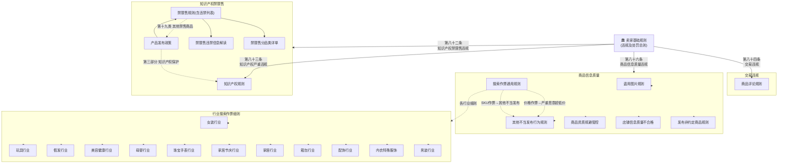

# 全球速卖通规则关系图谱

本图谱梳理 `Clippings/` 文件夹下全部25份速卖通平台规则文件之间的层级与引用关系。

---

## 🏛️ 一级：总纲（违规处罚总则）

| 文件 | 说明 |
|------|------|
| [[全球速卖通卖家基础规则（违规及处罚规则）]] | **核心枢纽**，定义四套积分体系（知识产权禁限售、知识产权严重违规、交易违规、商品信息质量违规），并链接所有子规则 |

> ⚡ 所有其他规则最终都通过此文件的 **第三章（违规及处罚规则）** 串联。

---

## 🔗 四套积分体系映射

卖家基础规则中将违规分为四大类，每类下挂对应的具体规则：

### ❶ 知识产权禁限售违规
| 规则文件 | 关系 |
|----------|------|
| [[全球速卖通禁限售规则(含违禁信息列表)]] | 违禁商品类目详细列表 + 扣分标准 |
| [[全球速卖通禁限售规则分品类要求详单]] | 按行业类目细分的禁限售要求（服饰、科技、美家等） |
| [[全球速卖通禁限售违禁信息解读]] | 违禁信息逐条案例解读 |
| [[全球速卖通产品发布政策]] | 禁限售商品的上位框架 + 知识产权保护政策 |
| ↳ **延伸参考** | [[全球速卖通知识产权规则]]（见下文❷） |

### ❷ 知识产权严重违规
| 规则文件 | 关系 |
|----------|------|
| [[全球速卖通知识产权规则]] | 知识产权侵权分级（商标/著作权/专利）、处罚标准，链接到禁限售列表 |

### ❸ 交易违规及其他
| 规则文件 | 关系 |
|----------|------|
| [[全球速卖通商品评论规则]] | 虚假评价、激励性评价、恶意评价等违规行为处罚 |

> 注：卖家基础规则还引用了「虚假发货」「成交不卖」「信用销量炒作」「严重扰乱平台秩序」「诱导提前收货」「引导线下交易」等规则，但这些文件尚未收录在 Clippings 中。

### ❹ 商品信息质量违规
| 规则文件 | 关系 |
|----------|------|
| [[全球速卖通搜索作弊通用规则]] | 信息展示类（类目错放、标题违规、属性错选、重复铺货）+ 价格作弊 + 交易行为类 |
| [[全球速卖通盗用图片及盗用水印图规则]] | 图片盗用/水印图盗用 |
| [[全球速卖通发布销售非约定商品规则]] | 品牌违规、隐藏信息、货不对版（SNAD） |
| [[全球速卖通其他不当发布行为规则]] | 虚假发布、站外引流等灰色手段 |
| [[全球速卖通店铺信息质量不合格管理规则]] | 店铺信息质量分 + 全店流量限制 |
| [[全球速卖通商品资质规避管控处罚规则]] | 类目错放规避资质审核的专门规则 |

---

## 🏭 行业搜索作弊处罚细则

以下12份文件是 [[全球速卖通搜索作弊通用规则]] 在各行业的具体执行细则：

| 行业 | 规则文件 |
|------|----------|
| 女装 | [[全球速卖通女装行业搜索作弊处罚规则]] |
| 男装 | [[全球速卖通男装行业搜索作弊处罚规则]] |
| 内衣特殊服饰 | [[全球速卖通内衣特殊服饰行业搜索作弊处罚规则]] |
| 配饰 | [[全球速卖通配饰行业搜索作弊处罚规则]] |
| 箱包 | [[全球速卖通箱包行业搜索作弊处罚规则]] |
| 家居 | [[全球速卖通家居行业搜索作弊处罚规则]] |
| 家居节庆 | [[全球速卖通家居节庆行业搜索作弊处罚规则]] |
| 珠宝手表 | [[全球速卖通珠宝手表行业搜索作弊处罚规则]] |
| 母婴 | [[全球速卖通母婴行业搜索作弊处罚规则]] |
| 美容健康 | [[全球速卖通美容健康行业搜索作弊处罚规则]] |
| 假发 | [[全球速卖通假发行业搜索作弊处罚规则]] |
| 玩具 | [[全球速卖通玩具行业搜索作弊处罚规则]] |

---

## 📊 关系图谱（Mermaid）

---

## 🔍 关键观察

1. **规则层次结构**：基础规则 → 四大违规类型 → 通用规则 → 行业细则，呈二级或三级树状结构。

2. **卖家基础规则"知识库关联"** 一节已内置了部分Wiki-link，说明清理者已有意识地建立连接，可在此基础上进一步完善。
