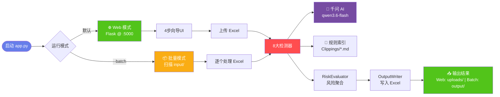
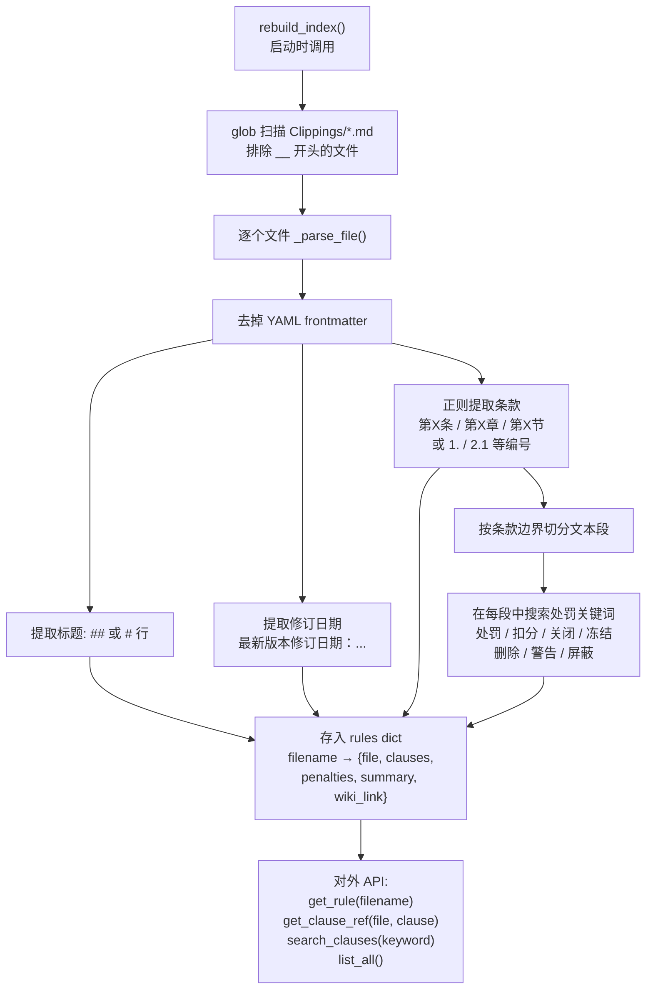
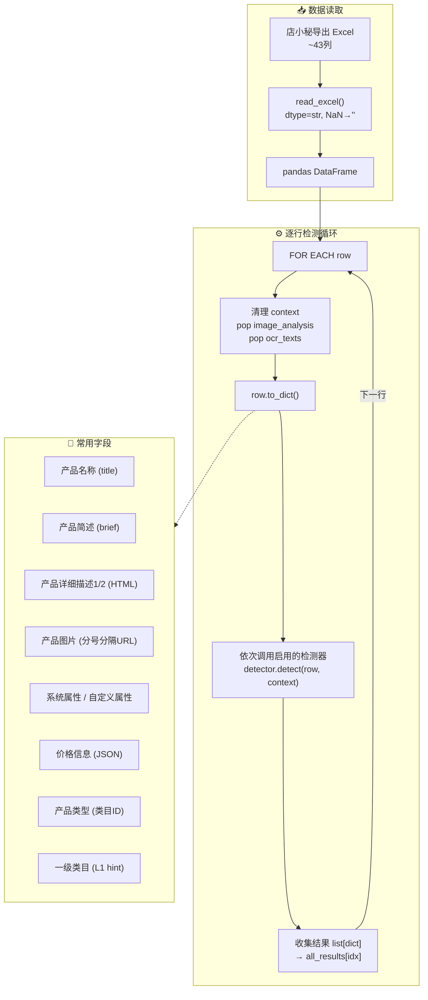
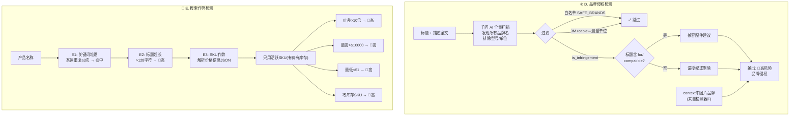
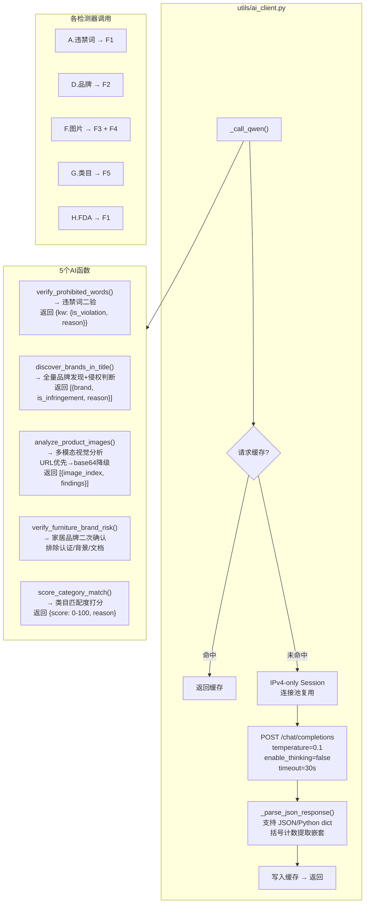
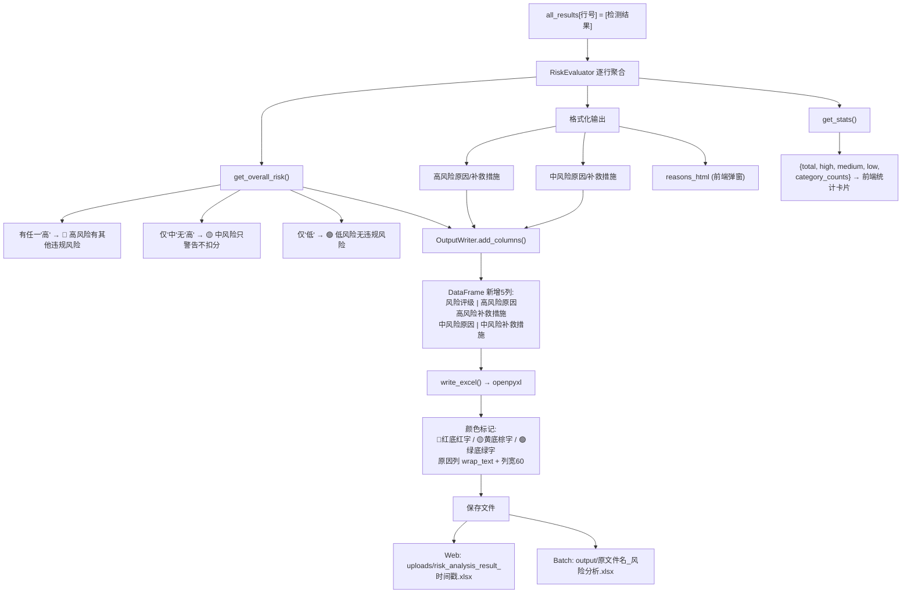
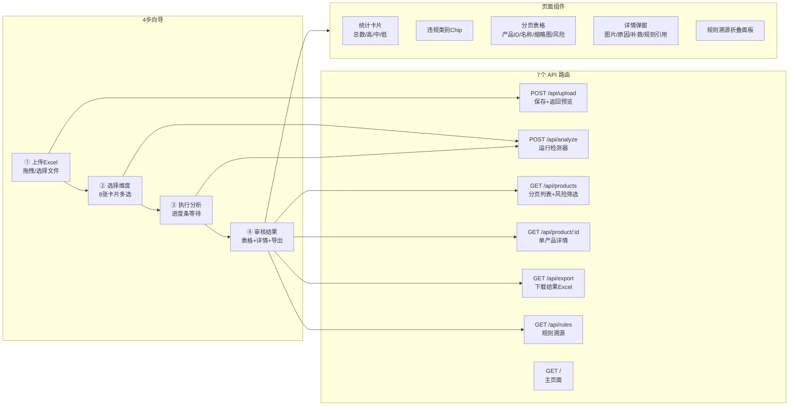

# 速卖通在线产品违规风险分析系统 — 流程图

---

## 1. 系统总览

---

## 2. 规则索引加载

---

## 3. 数据输入与检测核心循环

---

## 4. 检测器 A-C（文本/联系方式/HTML）

```mermaid
flowchart TB
    subgraph A["🚫 A. 违禁关键词检测"]
        A1["标题+简述+描述+属性"] --> A2["正则扫描 10类60+模式"]
        A2 --> A3{"上下文消歧?"}
        A3 -->|"wine+fridge → 跳过"| A_OK["✓ 安全上下文"]
        A3 -->|"通过"| A4["AI 批量验证"]
        A4 --> A5["输出: 🔴高风险<br/>禁限售违禁关键词"]
    end

    subgraph B["📞 B. 联系方式泄露"]
        B1["HtmlParsedResult 分离<br/>visible / hidden 文本"] --> B2{"隐藏文本有联系方式?"}
        B2 -->|是| B3["标记: 故意规避, 加重"]
        B2 -->|否| B4["检测可见文本字段"]
        B3 --> B4
        B4 --> B5["12种正则匹配<br/>手机号需上下文验证"]
        B5 --> B6["输出: 🟡中风险<br/>联系方式泄露"]
    end

    subgraph C["🔍 C. HTML结构分析"]
        C1["BeautifulSoup 深度解析"] --> C2["C1: 隐藏元素检测<br/>7种CSS隐藏方法"]
        C2 --> C3["C2: 外部链接检测<br/>排除AE官方域名"]
        C3 --> C4["C3: 表格 vs 属性比对<br/>材质不一致"]
        C4 --> C5["C4: 隐藏关键词堆砌<br/>词频≥3"]
        C5 --> C6["输出: 含违禁词→🔴高<br/>其他→🟡中"]
    end
```

---

## 5. 检测器 D-E（品牌/搜索作弊）

---

## 6. 检测器 F-H（图片/类目/FDA）

```mermaid
flowchart TB
    subgraph F["🖼️ F. 图片内容分析"]
        F1["解析产品图片URL列表"] --> F2{"HEAD预检<br/>URL可访问?"}
        F2 -->|"全部过期"| F_SKIP["跳过"]
        F2 -->|"可访问"| F3{"产品类目?"}
        F3 -->|家居/家具| F4["宽松Prompt<br/>忽略工厂背景/认证"]
        F3 -->|其他| F5["标准Prompt"]
        F4 --> F6["千问多模态视觉AI"]
        F5 --> F6
        F6 --> F7["检测8类:<br/>品牌/联系/水印/纯文字<br/>违禁品/不雅/图文不符/专利"]
        F7 --> F8["家居品牌→二次AI确认<br/>SAFE_BRANDS白名单过滤"]
        F8 --> F9["输出 + 存context<br/>主图<3张→🟡中"]
    end

    subgraph G["📂 G. 类目错放检测"]
        G1["类目ID→路径"] --> G2{"一级类目=<br/>美容健康?"}
        G2 -->|否| G_SKIP["跳过(仅支持美容健康)"]
        G2 -->|是| G3["Step1: 树查找<br/>L4/L3在美容健康子树?"]
        G3 -->|否| G4["→ 🟡中: 不在该L1下"]
        G3 -->|是| G5["Step2: AI打分(0-100)"]
        G5 -->|≥50| G_OK["✓ 正确"]
        G5 -->|<50| G6["Step3: 搜索替代类目"]
        G6 --> G7["→ 🟡中: 含推荐路径"]
    end

    subgraph H["💊 H. FDA非法宣称"]
        H1["标题+简述+描述"] --> H2["正则 4类:<br/>FDA认证/医疗功效<br/>医疗器械/保健品"]
        H2 --> H3["AI验证"]
        H3 --> H4["输出: 🔴高风险<br/>FDA-{子类}"]
    end
```

---

## 7. AI 层架构

---

## 8. 输出层

---

## 9. 前端交互流程

---

> **共 9 张图**，每张独立可读。建议用「阅读模式」查看，每张图自动渲染。图1是总览，图2-6是检测细节，图7是AI层，图8是输出，图9是前端。
