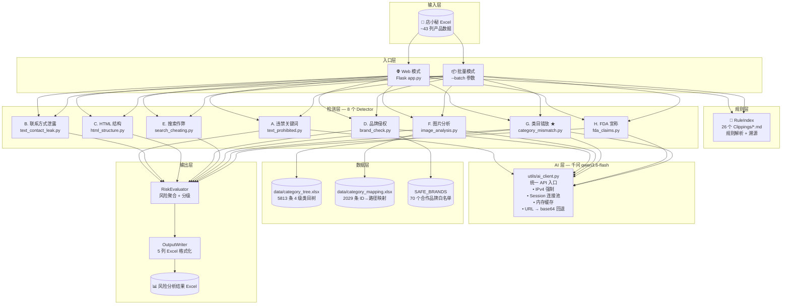

# 速卖通在线产品违规风险分析 — 项目说明

> **最后更新**: 2026-07-27
> **版本**: v2.0（类目错放已重写）
> **相关文档**: [[交接文档]]

---

## 一、项目概述

### 1.1 用途

对**店小秘导出的速卖通在线产品 Excel**，进行 **8 大维度自动风险检测**，输出带有风险评级、违规原因、补救措施的 Excel 报告。

### 1.2 核心能力

- 🔍 **8 维检测**：违禁关键词 / 联系方式泄露 / HTML 结构 / 品牌侵权 / 搜索作弊 / 图片分析 / 类目错放 / FDA 宣称
- 🤖 **AI 驱动**：千问 qwen3.6-flash 模型提供智能验证和视觉分析
- 📊 **结构化输出**：5 列风险报告（评级 + 高/中风险原因 + 高/中风险补救）
- 📖 **规则溯源**：每条发现关联到具体的速卖通规则条款
- 🔗 **三种运行方式**：Web 界面 / 批量命令行 / 独立 exe

### 1.3 三种运行方式

| 方式 | 命令 | 适用场景 |
|------|------|---------|
| Web 界面 | `python app.py` → `http://localhost:5000` | 手动上传、分步操作、逐条审核 |
| 批量命令行 | `python app.py --batch` | 扫描 `input/` 下所有 Excel，自动输出到 `output/` |
| 分发的 exe | 双击 `启动批量分析.bat` | 无 Python 环境的电脑使用 |

---

## 二、系统架构

### 2.1 架构全景图

> 🖼️ 另有手绘架构图（Excalidraw）：[[Excalidraw/Drawing 2026-07-28 14.35.12.excalidraw|架构全景图（Excalidraw）]]



### 2.2 数据流

```
逐行处理 (DataFrame.iterrows)
  │
  ├─ row_dict = row.to_dict()
  ├─ context = {"ocr_cache": {}}
  │
  ├─ For each detector in [A..H]:
  │     results += detector.detect(row_dict, context)
  │     └─ context["image_analysis"] ← ImageAnalysis → BrandCheck 读取
  │
  ├─ all_results[idx] = results
  │
  └─ OutputWriter(df, all_results)
       ├─ RiskEvaluator(results) 每行聚合
       ├─ 追加 5 列：风险评级 / 高风险原因 / 高风险补救 / 中风险原因 / 中风险补救
       └─ 保存为颜色标记的 Excel
```

### 2.3 Detector 间通信

| 生产者 | 消费者 | 通信方式 | 内容 |
|--------|--------|---------|------|
| `ImageAnalysisDetector` | `BrandCheckDetector` | `context["image_analysis"]` | 图片中检测到的品牌/logo findings |
| `ImageAnalysisDetector` | `BrandCheckDetector` | `context["ocr_texts"]` | OCR 识别文字（预留） |

> ⚠️ **重要**：每行处理前会清空 `context["image_analysis"]` 和 `context["ocr_texts"]`，防止跨产品数据泄漏。

---

## 三、目录结构

```
aliexpress_risk_analyzer/
├── app.py                        # Flask 入口 + --batch 批量模式（502 行）
├── config.py                     # 全局配置：路径/阈值/违禁词/品牌库/API（273 行）
├── rule_index.py                 # Clippings/*.md 规则解析器（单例，166 行）
├── risk_evaluator.py             # 风险聚合器：评级 + 高/中风险分列（182 行）
├── output_writer.py              # Excel 输出：5 列 + 颜色标记（88 行）
├── aliexpress_risk_analyzer.spec # PyInstaller 打包配置
├── 批量分析.bat                  # 开发环境批处理启动
├── 交接文档.md                   # 项目交接文档（446 行）
│
├── Clippings/                    # 26 个规则 .md（Obsidian 格式，含 YAML frontmatter）
│   ├── __全球速卖通规则关系图谱.md          # 规则关系图（非规则，RuleIndex 跳过）
│   ├── 全球速卖通卖家基础规则（违规及处罚规则）.md
│   ├── 全球速卖通禁限售规则(含违禁信息列表).md
│   ├── 全球速卖通禁限售违禁信息解读.md       # 最大文件（96KB）
│   ├── 全球速卖通知识产权规则.md
│   ├── 全球速卖通搜索作弊通用规则.md
│   ├── 全球速卖通其他不当发布行为规则.md
│   ├── 全球速卖通盗用图片及盗用水印图规则.md
│   ├── 全球速卖通店铺信息质量不合格管理规则.md
│   ├── 全球速卖通产品发布政策.md
│   ├── 全球速卖通商品评论规则.md
│   ├── 全球速卖通商品资质规避管控处罚规则.md
│   ├── 全球速卖通发布销售非约定商品规则.md
│   └── 全球速卖通*行业搜索作弊处罚规则.md   # 12 个行业细分规则
│
├── data/
│   ├── category_mapping.xlsx     # 类目 ID → 路径映射（2029 条）
│   └── category_tree.xlsx        # ★全类目 4 级树（5813 条，含 L1→L2→L3→L4 层级）
│
├── detectors/                    # 8 个检测器
│   ├── __init__.py
│   ├── base.py                   # BaseDetector 基类：统一 detect(row, context) 接口
│   ├── text_prohibited.py        # A. 违禁关键词：10 类正则 → 4 条消歧 → AI 验证
│   ├── text_contact_leak.py      # B. 联系方式泄露：微信/QQ/邮箱/手机号
│   ├── html_structure.py         # C. HTML 结构：C1 隐藏 / C2 外链 / C3 表格不一致 / C4 堆砌
│   ├── brand_check.py            # D. 品牌侵权：千问 AI 全量扫描标题
│   ├── search_cheating.py        # E. 搜索作弊：E1 堆砌 / E2 超长 / E3 SKU 价差
│   ├── image_analysis.py         # F. 图片分析：千问视觉 AI 8 项检查
│   ├── category_mismatch.py      # G. 类目错放：★三步流水线（树查找→AI 打分→替代搜索）
│   └── fda_claims.py             # H. FDA 非法宣称：4 类正则 + AI 验证
│
├── utils/                        # 7 个工具模块
│   ├── __init__.py
│   ├── ai_client.py              # ★千问 API 核心（518 行）：10 个函数，所有 AI 调用入口
│   ├── category_loader.py        # 类目加载器（387 行）：ID 映射 + 全树 + n-gram 搜索
│   ├── excel_io.py               # Excel 读写 + 颜色标记（102 行）
│   ├── html_parser.py            # BeautifulSoup 深度解析：可见/隐藏文本分离
│   ├── text_utils.py             # 文本工具：联系方式检测/品牌提取/结构化数据判断
│   ├── json_utils.py             # 安全 JSON 解析
│   └── image_fetch.py            # 图片下载缓存（ThreadPoolExecutor 并行）
│
├── templates/index.html          # Web 前端：4 步 SPA 向导
├── static/
│   ├── app.js                    # 前端交互：上传/分析/分页/详情弹窗
│   └── style.css                 # 样式：卡片布局/风险色标/响应式
│
├── input/                        # 批量模式输入目录（放待分析 Excel）
├── output/                       # 批量模式输出目录（分析结果 Excel）
├── uploads/                      # Web 模式上传暂存（自动创建）
├── image_cache/                  # 图片下载缓存（自动创建）
└── dist/                         # PyInstaller 打包产物
    ├── aliexpress_risk_analyzer.exe   # 独立可执行文件 ~35MB
    ├── 启动批量分析.bat               # 分发版双击启动
    ├── input/
    └── output/
```

---

## 四、8 大检测维度详解

### 4.1 风险等级速查

| 高风险 🔴 | 中风险 🟡 |
|-----------|-----------|
| 违禁关键词、标题品牌侵权、图片品牌/logo | 联系方式泄露 |
| 美容/医药/健康类目错放 | 标题关键词堆砌 |
| HTML 隐藏违禁词 | 标题超长（>128 字符仅高风险） |
| FDA 非法宣称 | 图片水印 |
| SKU 价差异常/超低价/零库存 | 图片联系方式 |
| | 其他类目错放 |
| | HTML 隐藏元素（无违禁词） |

### 4.2 各维度详情

#### A. 违禁关键词 (`detectors/text_prohibited.py`)

**检测范围**：标题、产品简述、产品详细描述、系统属性、自定义属性

**检测流程（三阶段）**：

```
阶段 1: 正则扫描 + 上下文消歧
  ├─ 10 大类违禁词正则（毒品/武器/管制刀具/烟草/酒精/赌博/色情/虚拟货币/假币/暴力）
  ├─ 4 条上下文消歧规则：
  │   ├─ wine + fridge/cooler/cabinet/rack... → 酒柜电器，跳过
  │   ├─ rum + cocktail/syrup/cake/food... → 食品，跳过
  │   ├─ sex + unisex/bisexual... → 合成词，跳过
  │   └─ explosive + safety/warning/caution... → 安全说明，跳过
  └─ → 收集候选匹配列表

阶段 2: 千问 AI 批量二次验证
  └─ verify_prohibited_words() → {keyword: {is_violation, ai_reason}}

阶段 3: 过滤
  └─ 只保留 AI 确认 is_violation=true 的匹配
  └─ AI 未覆盖的关键词：保守处理，视为违规
```

**风险等级**：高

**配置位置**：`config.py` → `PROHIBITED_PATTERNS`（10 大类）、`detectors/text_prohibited.py` → `CONTEXT_EXCLUSIONS`（消歧规则）

---

#### B. 联系方式泄露 (`detectors/text_contact_leak.py`)

**检测范围**：标题、简述、描述（区分可见/隐藏文本）、系统属性、自定义属性

**检测模式**：12 种正则，由 `utils/text_utils.py` → `find_contacts_in_text()` 统一实现

| 类型 | 正则示例 |
|------|---------|
| 微信 | `\bwechat\b\|微信\|we\s?chat` |
| WhatsApp | `\bwhatsapp\b`, `wa\.me/` |
| QQ | `\bqq\s?\d\|\bqicq\b` |
| 邮箱 | `[a-zA-Z0-9._%+-]+@[a-zA-Z0-9.-]+\.[a-zA-Z]{2,}` |
| 中国手机号 | `(?<!\d)(\+86[\s\-]?)?1[3-9]\d{9}(?!\d)` + 上下文验证 |
| Skype/Facebook/Instagram/Telegram/VK/Line | 各自关键字正则 |

> ⚠️ **手机号上下文验证**：必须附近 20 字符内出现 `phone/tel/mobile/微信/contact/call/sms/chat` 等词才判定为真实手机号，避免 11 位数字误报。

**风险等级**：中（隐藏文本中的联系方式会有加重说明）

---

#### C. HTML 结构 (`detectors/html_structure.py`)

使用 `BeautifulSoup` 进行深度 HTML 解析（`utils/html_parser.py`），**不剥离 HTML**。

| 子检测 | 内容 | 风险 |
|--------|------|------|
| **C1 隐藏元素** | 检测 `display:none`/`visibility:hidden`/`opacity:0` 等 7 种隐藏技术 | 高（含违禁词）/ 中 |
| **C2 外部链接** | 检测非速卖通官方域名的 `<a>` 链接 | 高 |
| **C3 表格不一致** | 对比 HTML 表格与系统属性中的材质/面料等关键参数 | 中 |
| **C4 隐藏堆砌** | 隐藏文本中的关键词重复 ≥3 次 | 中 |

> ⚠️ **平台数据过滤**：`is_structured_data()` 识别并跳过速卖通平台注入的 JSON 配置数据（`display:none` 的配置 div），避免误报。

**速卖通官方域名白名单**（`config.py` → `AE_OFFICIAL_DOMAINS`）：
`aliexpress.com`, `aliexpress.ru`, `alicdn.com`, `ae-pic-a1.aliexpress-media.com`, 等 10 个域名

---

#### D. 品牌侵权 (`detectors/brand_check.py`)

**核心理念**：不依赖品牌库做正则匹配，由**千问 AI 全量扫描标题**，发现任意品牌名并判断侵权。

**检测流程**：

```
输入: 标题 + 描述
  │
  ├─ D1: 标题品牌检测
  │    ├─ discover_brands_in_title(title, description) → AI 全量发现
  │    ├─ 过滤 SAFE_BRANDS 白名单（70 个合作品牌）
  │    ├─ 过滤测量单位误判：_is_measurement_context()
  │    │   └─ 如 "3M cable" → 3 米线材，非 3M 品牌
  │    └─ 仅保留 is_infringement=true 的品牌
  │
  └─ D2: 图片品牌检测（通过 context 接收）
       ├─ context["image_analysis"] ← ImageAnalysisDetector
       ├─ 提取 brand/logo/trademark 类 findings
       └─ SAFE_BRANDS 过滤（reason 字段字符串包含匹配）
```

**3M 测量单位消歧（双层防护）**：

| 层 | 位置 | 方式 |
|----|------|------|
| AI Prompt | `utils/ai_client.py` → `DISCOVER_BRAND_PROMPT` | 告知 AI：数字+单位的尺寸规格不是品牌名 |
| 代码过滤 | `detectors/brand_check.py` → `_is_measurement_context()` | 品牌名匹配 `\d+M` 且标题含测量关键词时自动跳过 |

**测量关键词**（`_MEASUREMENT_CONTEXT_KW`）：cable, wire, strip, rope, cord, tube, pipe, hose, LED, HDMI, 米, 线, 绳, 管, 灯…

**风险等级**：高

---

#### E. 搜索作弊 (`detectors/search_cheating.py`)

| 子检测 | 阈值 | 风险 |
|--------|------|------|
| **E1 标题关键词堆砌** | 同一词 ≥ 3 次（过滤停用词后） | 中 |
| **E2 标题超长** | > 128 字符 | 高 |
| **E3 SKU 价差** | 最高价/最低价 > 10 倍 | 高 |
| **E4 SKU 超低价** | 最低价 < $1（仅活跃 SKU） | 高 |
| **E5 SKU 价格异常** | 最高价 > $10,000 | 高 |
| **E6 SKU 零库存** | 存在库存为 0 的 SKU（多 SKU 时） | 高 |

> ⚠️ **活跃 SKU 区分**：仅评估 `price > 0 且 qty > 0` 的 SKU，废弃不用的零售价不参与价格评估。

**停用词过滤**（`config.py` → `TITLE_STOP_WORDS`）：~70 个常见英文停用词 + 噪声词（1pcs, lot, new, hot, quality, wholesale...）

---

#### F. 图片分析 (`detectors/image_analysis.py`)

使用**千问视觉 AI** 分析产品图片，检测 8 类违规。**仅读取「产品图片」列**（跳过白底图、场景图）。

**8 项检查**：

| # | 检查项 | 说明 |
|---|--------|------|
| 1 | 品牌 Logo/文字 | 图片中的商标侵权 |
| 2 | 联系方式 | 图片中的电话/邮箱/微信等 |
| 3 | 水印 | 非卖家自有水印（盗图风险） |
| 4 | 纯文字图片 | 主图为文字/促销而非产品（不包含规格表/尺寸表） |
| 5 | 违禁物品 | 武器/毒品/烟草等 |
| 6 | 不当内容 | 裸露/血腥/冒犯内容 |
| 7 | 图片不匹配 | 图片与标题描述明显不符 |
| 8 | 设计专利风险 | 模仿知名专利设计（Dyson/AirPods/LEGO/Crocs） |

**图片传输策略（三级降级）**：

```
0. HEAD 预检: _check_urls_reachable() 快速检查前 3 张图片 → 全部失效则直接跳过
1. URL 直传: 图片 URL 直接发给千问 → 千问服务器下载分析
   ↓ HTTP 400 (data_inspection_failed)
   → 重试 1 次（防网络波动），不触发 base64 回退
   ↓ 其他失败
2. Base64 回退: 本地下载图片 → 转 base64 data URI → 发给千问
   （Referer: aliexpress.com, timeout=20s, 失败重试 1 次）
3. 全部失败 → 跳过该产品图片分析
```

**家居类三层品牌防护**（`utils/ai_client.py`）：

| 层 | 机制 | 说明 |
|----|------|------|
| 第一层 | 类目识别 | `_is_furniture_category()` 匹配 ~40 个中英文关键词（家具/卫浴/厨/灯/bathroom/furniture...） |
| 第二层 | 独立 prompt | `VISION_PROMPT_FURNITURE`：只有品牌 logo 印刷/雕刻在**产品主体上**才算侵权，排除认证标记/背景建筑/工厂照片 |
| 第三层 | 文本 AI 二次确认 | `verify_furniture_brand_risk()`：对视觉 AI 的 brand/logo finding 做文本 AI 确认，假阳性直接过滤 |

**风险等级**：品牌/logo → 高 / 水印 → 中 / 其他 → 按 AI 判定

**主图数量检查**：产品图片 < 3 张 → 中风险提示

---

#### G. 类目错放 ★ (`detectors/category_mismatch.py`)

> **★ v2.0 重写**：旧方案由 AI 选择类目，存在跨 L1 幻觉问题（31/49 产品被错误推荐家具路径）。新方案改为三步流水线，AI 只打分不选类目，根除 LLM 幻觉。

**核心算法（三步流水线）**：

```
输入: 产品标题+描述 + 卖家已选L4/L3名 + 一级类目（目前仅「美容健康」）
  │
  ▼
Step 1: 树查找 — match_category_tiered(chosen_l4, chosen_l3, l1="美容健康")
  ├─ L4 名在 L1 子树中存在？ → 获取完整路径，进入 Step 2
  ├─ L4 不存在，L3 存在？   → 获取 L1>L2>L3 路径，进入 Step 2
  └─ 都不存在               → 「不在该L1下」（中风险，结束）
  │
  ▼
Step 2: AI 相关度打分 — score_category_match(title, desc, path) → 0-100
  ├─ ≥ 50 分 → 匹配正确，不标记（结束）
  └─ < 50 分 → 进入 Step 3
  │
  ▼
Step 3: 替代路径搜索 — search_categories(title, l1_filter="美容健康")
  ├─ 找到更匹配路径 → 标记错放，推荐替代路径
  └─ 找不到       → 「有错放风险，请核查」（中风险，结束）
```

**新旧方案对比**：

| 维度 | 旧方案 | 新方案 |
|------|--------|--------|
| AI 角色 | 选择类目 | 打分 + 搜索 |
| 跨 L1 幻觉 | 31/49 错误推荐家具 | 零（树查找限定了 L1） |
| 不确定处理 | 强行推荐（高风险） | 标记核查（中风险） |
| 确定性 | 低（LLM 概率输出） | 高（树查找是确定性的） |

**当前限制**：

- 仅启用「**美容健康**」一级类目。其他 L1 产品直接跳过。
- 列名兼容 `一级类目` 和 `一级目录` 两种写法。
- 扩展其他 L1：修改 `category_mismatch.py` L91 守卫条件 `if l1_hint != "美容健康": return results`。
- 英文标题在中文类目树中 n-gram 搜索效果差，容易进入「请核查」分支。

**涉及文件**：

| 文件 | 职责 |
|------|------|
| `data/category_tree.xlsx` | 5813 条 4 级全类目树 |
| `data/category_mapping.xlsx` | 2029 条类目 ID→路径映射 |
| `utils/category_loader.py` | `match_category_tiered(l4, l3, l1)` — 树查找 |
| `utils/ai_client.py` | `score_category_match(title, desc, path)` — AI 打分 0-100 |
| `detectors/category_mismatch.py` | 三步流水线主逻辑 |

**风险等级**：美容/医药/健康类 → 高 / 其他类 → 中

---

#### H. FDA 非法宣称 (`detectors/fda_claims.py`)

**参考规则**：《不当发布行为规则》第三条、《产品发布政策》第七条。

**检测流程**：与 A 检测器相同的三阶段模式（正则 → AI → 过滤）

**4 类正则**（`config.py` → `FDA_ILLEGAL_PATTERNS`）：

| 类别 | 示例模式 |
|------|---------|
| FDA 虚假认证 | `FDA (approved\|certified\|registered\|cleared\|listed\|compliant)` |
| 虚假医疗功效 | `(cure\|treats\|heals) (cancer\|tumor\|diabet\|HIV)` |
| 非法医疗器械 | `laser hair removal\|lipo laser\|dermal filler\|botox` |
| 虚假保健品宣称 | `lose weight in X days\|grow taller in\|detox body` |

**风险等级**：高

---

## 五、千问 AI 详解

### 5.1 配置

| 参数 | 值 |
|------|-----|
| API Key | `sk-your-qwen-api-key`（Token Plan 团队版） |
| Base URL | `https://token-plan.cn-beijing.maas.aliyuncs.com/compatible-mode/v1` |
| 模型 | `qwen3.6-flash`（全部调用统一使用） |
| 超时 | 30s |
| 重试 | 1 次 |
| 思考模式 | `enable_thinking: false` |
| 连接优化 | IPv4 强制 + `requests.Session` 连接池 + 内存缓存 |

### 5.2 AI 函数全览

所有函数在 `utils/ai_client.py`，这是**唯一的 AI 调用入口**。

| 函数 | 调用方 | 返回值 | max_tokens |
|------|--------|--------|------------|
| `_call_qwen(messages, ...)` | 底层 HTTP | `str 或 None` | 按需 |
| `_parse_json_response(text)` | 所有 AI 调用 | `dict 或 None` | — |
| `_extract_json_block(text)` | `_parse_json_response` | `str 或 None` | — |
| `verify_prohibited_words(name, matches)` | A. 违禁词 / H. FDA | `{keyword: {is_violation, ai_reason}}` | 800 |
| `discover_brands_in_title(title, desc)` | D. 品牌侵权 | `[{brand_name, is_infringement, reason}]` | 1000 |
| `analyze_product_images(urls, name, desc, cat)` | F. 图片分析 | `[{image_index, findings}]` | 1500 |
| `verify_furniture_brand_risk(name, finding)` | F. 家居品牌 | `bool` | 100 |
| `score_category_match(title, desc, path)` | G. 类目打分 | `{score: 0-100, reason}` | 100 |
| `_check_urls_reachable(urls)` | F. 预检 | `bool` | — |
| `_download_image_as_base64(url, timeout)` | F. 回退 | `str 或 None` | — |
| `_is_furniture_category(path)` | F. 类目判断 | `bool` | — |

### 5.3 JSON 解析的四重兜底

```
_parse_json_response(text)
  ├─ ① json.loads(text)           # 标准 JSON
  ├─ ② ast.literal_eval(text)     # Python dict（千问偶尔返回单引号格式）
  ├─ ③ _extract_json_block(text)  # 括号计数提取嵌套 JSON（替代旧版浅层正则）
  └─ ④ 返回 None + 打印 raw response 前 300 字符
```

> **`_extract_json_block()` 改进**：旧版 `\{[^{}]*\}` 正则只匹配单层花括号，嵌套对象（如 `{"brands": [{...}, {...}]}`）会被截断。改为括号计数算法，支持字符串内花括号和转义符。

### 5.4 图片分析传输策略

详见 [F. 图片分析](#f-图片分析-detectorsimage_analysispy) 章节的三级降级流程。

### 5.5 已知 AI 行为特征

| 现象 | 处理方式 |
|------|---------|
| 千问返回 Python dict（单引号） | `ast.literal_eval` 兜底 |
| 模型不按 prompt 格式返回 | 导致个别产品品牌漏检 |
| 品牌 JSON 嵌套截断 | `_extract_json_block()` 括号计数修复 + `max_tokens` 升至 1000 |
| `data_inspection_failed` 审核拦截 | 重试 1 次，不触发 base64 回退 |
| 速卖通图片 URL 时效性 | HEAD 预检 → 全部失效则跳过 |
| 千问忽略用户消息中的放宽指令 | 家居类使用独立系统 prompt + 代码层二次确认 |
| 大批量视觉分析 JSON parse failed | `max_tokens=1500` 可能不够，可调至 4096 |

---

## 六、品牌白名单管理

### 6.1 三处同步

`SAFE_BRANDS` 白名单（70 个合作品牌）在 **3 个位置** 生效，增删改品牌时必须 **全部同步**：

| # | 文件 | 位置 | 格式 |
|---|------|------|------|
| 1 | `config.py` | `SAFE_BRANDS` 列表 | Python list，全小写 |
| 2 | `utils/ai_client.py` | `VISION_PROMPT` 末尾 | 自然语言品牌列表 |
| 3 | `utils/ai_client.py` | `VISION_PROMPT_FURNITURE` 末尾 | 自然语言品牌列表 |

### 6.2 三个生效路径

| 检测路径 | 文件 | 过滤方式 |
|---------|------|---------|
| 标题品牌检测 | `detectors/brand_check.py` → `_check_title_brands()` | AI 返回的 `brand_name` **精确匹配**（大小写不敏感） |
| 图片品牌检测 | `detectors/image_analysis.py` → `detect()` | 视觉 AI finding 的 `reason` 字段**包含匹配** |
| 图片→品牌桥接 | `detectors/brand_check.py` → `_check_image_brands()` | 同上，`reason` 字段包含匹配 |

> ⚠️ **图片检测路径的局限**：代码层通过 `reason` 字段做包含匹配而非精确匹配（视觉 AI 不返回结构化的 `brand_name`）。如果 AI 的 `reason` 未提及品牌名（如只写 "brand logo visible on product"），代码层无法过滤。此时依赖 prompt 层的自然语言提示作为第一道防线。

---

## 七、配置速查

### 7.1 路径配置

所有路径基于 `__file__` 相对定位，兼容 PyInstaller 打包（`sys._MEIPASS`）。

| 变量 | 用途 | 打包后行为 |
|------|------|-----------|
| `CLIPPINGS_DIR` | 26 个规则 .md | 打包进 exe（只读） |
| `CATEGORY_TREE_PATH` | 全类目树 xlsx | 打包进 exe（只读） |
| `IMAGE_CACHE_DIR` | 图片下载缓存 | exe 旁自动创建 |
| `UPLOAD_DIR` | Web 上传暂存 | 自动创建 |
| `BATCH_INPUT_DIR` | 批量模式输入 | exe 旁手动放置 |
| `BATCH_OUTPUT_DIR` | 批量模式输出 | 运行时自动输出 |

### 7.2 关键阈值

| 参数 | 默认值 | 说明 |
|------|--------|------|
| `TITLE_LENGTH_MAX` | 128 | 标题超长阈值（字符） |
| `TITLE_KEYWORD_REPEAT_MAX` | 3 | 关键词堆砌阈值（出现次数） |
| `SKU_PRICE_RATIO_MAX` | 10 | SKU 价差比阈值 |
| `SKU_PRICE_MAX` | 10000 | 单 SKU 异常高价（美元） |
| `SKU_PRICE_MIN` | 1 | 单 SKU 异常低价（美元） |
| `AI_REQUEST_TIMEOUT` | 30 | 千问 API 超时（秒） |
| `AI_MAX_RETRIES` | 1 | API 失败重试次数 |

### 7.3 列名映射

| 变量 | 对应 Excel 列 |
|------|-------------|
| `COL_PRODUCT_ID` | 店小秘产品ID |
| `COL_PRODUCT_NAME` | 产品名称 |
| `COL_PRODUCT_IMAGES` | 产品图片 |
| `COL_PRODUCT_TYPE` | 产品类型（类目 ID） |
| `COL_PRODUCT_GROUP` | 产品分组 |
| `COL_DESC_BRIEF` | 产品简述 |
| `COL_DESC1` | 产品详细描述1 |
| `COL_DESC2` | 产品详细描述2 |
| `COL_SYS_ATTRS` | 系统属性 |
| `COL_CUSTOM_ATTRS` | 自定义属性 |
| `COL_PRICE_INFO` | 价格信息（JSON） |
| `COL_WEIGHT` | 产品包装后的重量 |
| `COL_SHIPPING_TEMPLATE` | 运费模板 |
| `COL_SOURCE_URL` | 来源url |
| `COL_SHOP_NAME` | 所属店铺 |

---

## 八、Excel 输入/输出格式

### 8.1 输入要求

店小秘导出的 Excel，**最后一列须为 `一级类目` 或 `一级目录`**（两种列名均兼容）。目前仅「美容健康」触发类目错放检测，但仍建议所有产品填写该列以便后续扩展。

### 8.2 输出格式

在原始数据右侧追加 5 列：

| 列名 | 内容示例 |
|------|---------|
| **风险评级** | `高风险有其他违规风险` / `中风险只警告不扣分` / `低风险无违规风险` |
| **高风险原因** | `1. [全球速卖通知识产权规则] 商标侵权 标题中检测到品牌词：'Nike'...` |
| **高风险补救措施** | `1. 请确认是否持有相关品牌的商标授权...` |
| **中风险原因** | `1. [全球速卖通卖家基础规则] 第八十六条(五) 检测到联系方式...` |
| **中风险补救措施** | `1. 请删除产品描述中的联系方式...` |

每行按风险等级分别列出高/中风险的原因和补救，带规则溯源 `[规则文件名] 条款`，类目错放含 `（一级类目: xxx）` 和 `推荐路径: L1 > L2 > L3 > L4`。

---

## 九、Web API 路由

| 路由 | 方法 | 功能 |
|------|------|------|
| `/` | GET | 主页面（4 步 SPA 向导） |
| `/api/upload` | POST | 上传 Excel（FormData） |
| `/api/analyze` | POST | 开始分析 `{detectors: ["text_prohibited", ...]}` |
| `/api/products?risk=&page=&page_size=` | GET | 产品列表（分页 + 风险筛选） |
| `/api/product/<index>` | GET | 单产品详情（含高/中风险分列） |
| `/api/export` | GET | 下载结果 Excel |
| `/api/rules` | GET | 规则索引元数据 |

---

## 十、关键设计决策

### 10.1 类目错放重写（v2.0）

**问题**：旧方案由 AI 选择类目 → LLM 跨 L1 幻觉 → 31/49 产品被错误推荐家具路径。

**方案**：AI 只做相关度评分（0-100），树查找做确定性验证。不确定时标记「请核查」而非强行推荐。

### 10.2 家居类品牌放松

**问题**：视觉 AI 将家具产品的背景建筑 logo、工厂认证标记误判为品牌侵权。

**方案**：三层防护 — 类目识别 → 独立系统 prompt → 文本 AI 二次确认。假阳性直接过滤。

### 10.3 测量单位消歧

**问题**："3M cable" 中的 "3M" 被 AI 误判为 3M 品牌。

**方案**：双层防护 — AI prompt 说明 + 代码 `_is_measurement_context()` 过滤。

### 10.4 图片传输 URL → base64 回退

**问题**：千问服务器无法直接下载某些速卖通 CDN 图片（时效性、防盗链）。

**方案**：URL 直传优先，失败后本地下载转 base64。HEAD 预检快速跳过全部失效的产品。

### 10.5 JSON 解析加固

**问题**：千问返回格式不稳定（Python dict 单引号、嵌套 JSON 截断、随机字段名）。

**方案**：四重兜底解析 + 括号计数算法替代浅层正则。

---

## 十一、扩展指南

### 11.1 添加新检测维度

1. 在 `detectors/` 下创建新的 detector 文件，继承 `BaseDetector`
2. 实现 `detect(self, row, context)` → `list[dict]`
3. 在 `app.py` 的 `run_batch()` 和 `/api/analyze` 中注册
4. 在 `templates/index.html` 中添加选择卡片
5. 在 `aliexpress_risk_analyzer.spec` 的 `hiddenimports` 中添加

### 11.2 类目错放扩展到其他 L1

修改 `detectors/category_mismatch.py` L91：
```python
# 当前：
if l1_hint != "美容健康":
    return results

# 扩展为：
ALLOWED_L1 = ["美容健康", "家居", "电子产品"]
if l1_hint not in ALLOWED_L1:
    return results
```

### 11.3 添加品牌白名单

需同时修改 3 处（详见[第六节](#六品牌白名单管理)）：
1. `config.py` → `SAFE_BRANDS`（全小写）
2. `utils/ai_client.py` → `VISION_PROMPT` 末尾
3. `utils/ai_client.py` → `VISION_PROMPT_FURNITURE` 末尾

### 11.4 添加违禁关键词

在 `config.py` → `PROHIBITED_PATTERNS` 中添加新的正则模式。如有误报风险，同时在 `detectors/text_prohibited.py` → `CONTEXT_EXCLUSIONS` 中添加消歧规则。

### 11.5 调整风险等级

修改对应 detector 文件中 `_make_result(risk_level=...)` 的参数，或修改 `risk_evaluator.py` → `get_overall_risk()` 的评级逻辑。

### 11.6 扩展家居类目关键词

在 `utils/ai_client.py` → `_FURNITURE_CATEGORY_KW` 中添加新的中英文关键词。

### 11.7 更换 API Key

1. 修改 `config.py` 中的 `QWEN_API_KEY`
2. 验证 key 可用：`requests.post(base_url + "/chat/completions", ...)`
3. 重建 exe：`rm -f dist/aliexpress_risk_analyzer.exe && python -m PyInstaller --noconfirm aliexpress_risk_analyzer.spec`

---

## 十二、PyInstaller 打包

### 构建命令

```bash
python -m PyInstaller --noconfirm aliexpress_risk_analyzer.spec
```

### 产物

```
dist/
├── aliexpress_risk_analyzer.exe   (~35MB，单文件)
├── 启动批量分析.bat
├── input/
└── output/
```

### spec 关键配置

- `datas`: `templates/`, `static/`, `data/`, `Clippings/` 打包进 exe
- `hiddenimports`: 22 个模块（8 detector + 7 util + 3 core + 4 third-party）
- `console=True`: 保留控制台窗口（能看到进度和错误）

### 修改后重建流程

1. 修改代码
2. 删除旧 exe：`rm -rf dist/aliexpress_risk_analyzer.exe`
3. 重新打包
4. 验证：复制一个小 Excel 到 `dist/input/`，运行 `dist/aliexpress_risk_analyzer.exe --batch`

---

## 十三、常见问题排查

| 现象 | 原因 | 解决 |
|------|------|------|
| `[AI Error] Connection error` | 网络不通 | 检查防火墙/DNS，确认千问 API 可达 |
| `[AI Error] HTTP 403` | API key 无效或 IP 白名单 | 检查 `QWEN_API_KEY` |
| `[AI Error] HTTP 400: Failed to download multimodal content` | 千问拉不到图片 | 自动触发 base64 回退 |
| `[AI Error] HTTP 400: data_inspection_failed` | 图片被安全审核拦截 | 重试 1 次后跳过，不触发 base64 |
| `[Vision] All image URLs unreachable` | 图片 URL 全部过期 | HEAD 预检发现 → 跳过（节省 API 调用） |
| `[Furniture Verify] False alarm filtered` | 家居品牌误报被二次确认过滤 | 正常日志，无需处理 |
| `AI brand discovery failed` | 千问返回格式异常 | 已优化，较罕见 |
| `[AI] JSON parse failed`（视觉） | `max_tokens=1500` 不够 | 调大 `analyze_product_images()` 中 `max_tokens` |
| 3M 被误判为品牌 | 测量上下文未识别 | 扩展 `_MEASUREMENT_CONTEXT_KW` |
| 类目错放大量误报 | 列名不对或 L1 非美容健康 | 确认列名 + 仅美容健康启用 |
| 类目错放仍推荐家具路径 | 旧代码缓存 | 删 `detectors/__pycache__/` 后重跑 |
| 大批量视觉 JSON parse failed | 多图+多违规时输出过长 | 调大 `max_tokens` 到 4096 |
| 进度条 GBK 乱码 | Windows CMD 编码 | bat 已设 `chcp 65001` |
| 打包后 exe 找不到规则 | Clippings 未打包 | 重新打包 |
| 家居类品牌误报 | 关键词未覆盖 | 扩展 `_FURNITURE_CATEGORY_KW` |

---

## 十四、技术栈

| 层 | 技术 |
|----|------|
| Web 框架 | Flask 3.x |
| Excel 处理 | pandas + openpyxl |
| HTML 解析 | BeautifulSoup4 + lxml |
| AI 模型 | 千问 qwen3.6-flash（阿里云百炼 Token Plan） |
| HTTP 客户端 | requests（Session 连接池 + IPv4 monkey-patch） |
| 前端 | 原生 HTML/CSS/JS（无框架依赖） |
| 打包 | PyInstaller（单文件 ~35MB exe） |
| Python | 3.14 |
| 规则格式 | Markdown + YAML frontmatter（Obsidian 兼容） |
| 运行平台 | Windows 10/11 |

---

> **相关文档**：[[交接文档]]（更详细的故障排查和新人接手指南）
